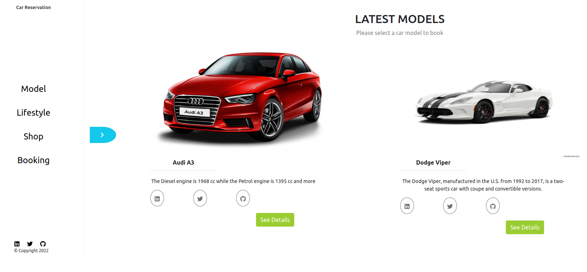

  <!-- You are encouraged to replace this logo with your own! Otherwise you can also remove it. -->
  
   

  <h3><b>Microverse README Template</b></h3>

<!-- TABLE OF CONTENTS -->

# 📗 Table of Contents

- [📖 About the Project](#about-project)
  - [🛠 Built With](#built-with)
    - [Tech Stack](#tech-stack)
    - [Key Features](#key-features)
  - [🚀 Live Demo](#live-demo)
- [💻 Getting Started](#getting-started)
  - [Setup](#setup)
  - [Prerequisites](#prerequisites)
  - [Install](#install)
  - [Usage](#usage)
  - [Run tests](#run-tests)
  - [Deployment](#triangular_flag_on_post-deployment)
- [👥 Authors](#authors)
- [🔭 Future Features](#future-features)
- [🤝 Contributing](#contributing)
- [⭐️ Show your support](#support)
- [🙏 Acknowledgements](#acknowledgements)
- [❓ FAQ](#faq)
- [📝 License](#license)

<!-- PROJECT DESCRIPTION -->

# 📖 car-reservation-frontend 

**car-reservation-frontend** is a React front end app to book a car.

  

## 🛠 Built With 

### Tech Stack 

  
Languages

  <ul>
    <li>Javascript</li>
    <li>React.js</li>
  </ul>

  
Frameworks

  <ul>
    <li>Redux</li>
    <li>Bootstrap</li>
  </ul>

  
Technologies

  <ul>
    <li>EsLint</li>
    <li>StyleLint</li>
    <li>Webpack</li>
  </ul>

<!-- Features -->

### Key Features 

- **User Login**
- **User Signup**
- **Book Car**
- **Reserve Car**
- **Add Car - admins only**
- **Delete Car - admins only**

(<a href="#readme-top">back to top</a>)

<!-- LIVE DEMO -->

## 🚀 Live Demo 

- Click [here](https://yourdeployedapplicationlink.com)

(<a href="#readme-top">back to top</a>)

<!-- GETTING STARTED -->

## 💻 Getting Started 

To get a local copy up and running, follow these steps.

### Prerequisites

In order to run this project you need to install:

- ReactJS
- NPM

### Setup

Clone this repository to your desired folder:

- git clone https://github.com/Pamphilemkp/car-reservation-frontend.git

### Install

Install this project with:

- cd car-reservation-frontend
- npm install

### Usage

To run the project, execute the following command:

- npm start

(<a href="#readme-top">back to top</a>)

<!-- AUTHORS -->

## 👥 Authors 

👤 **Author1**

- GitHub: [@githubhandle](https://github.com/githubhandle)
- Twitter: [@twitterhandle](https://twitter.com/twitterhandle)
- LinkedIn: [LinkedIn](https://linkedin.com/in/linkedinhandle)

👤 **Author2**

- GitHub: [@p_ndungu_maina](https://github.com/PNdunguMaina)
- LinkedIn: [Patrick Maina](https://www.linkedin.com/in/pndungumaina/)

(<a href="#readme-top">back to top</a>)

<!-- FUTURE FEATURES -->

## 🔭 Future Features 

- [ ] **Rotate Image**
- [ ] **More images page**

(<a href="#readme-top">back to top</a>)

<!-- CONTRIBUTING -->

## 🤝 Contributing 

Contributions, issues, and feature requests are welcome!

Feel free to check the [issues page](../../issues/).

(<a href="#readme-top">back to top</a>)

<!-- SUPPORT -->

## ⭐️ Show your support 

If you like this project, please give it a star.

(<a href="#readme-top">back to top</a>)

<!-- ACKNOWLEDGEMENTS -->

## 🙏 Acknowledgments 

- [Microverse](https://www.google.com/url?sa=t&rct=j&q=&esrc=s&source=web&cd=&cad=rja&uact=8&ved=2ahUKEwjoytLh7LD8AhVCi_0HHaFRC8IQFnoECCAQAQ&url=https%3A%2F%2Fwww.microverse.org%2F&usg=AOvVaw3axmd_a5aGKI5J_-Bba_rQ)
- [Murat Korkmaz](https://www.behance.net/muratk)

(<a href="#readme-top">back to top</a>)

<!-- LICENSE -->

## 📝 License 

This project is [MIT](./LICENSE) licensed.

_NOTE: we recommend using the [MIT license](https://choosealicense.com/licenses/mit/) - you can set it up quickly by [using templates available on GitHub](https://docs.github.com/en/communities/setting-up-your-project-for-healthy-contributions/adding-a-license-to-a-repository). You can also use [any other license](https://choosealicense.com/licenses/) if you wish._

(<a href="#readme-top">back to top</a>)

